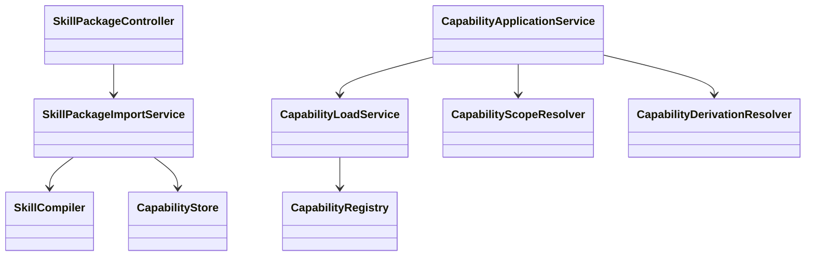

# Capability 模块

## 职责与非职责

- 负责 SkillPackage、SkillCompiler、CapabilitySource 和 LoopNode 局部加载。
- 不直接执行脚本；脚本只能注册为受权限约束的 Tool executable。

## 类图



## 核心流程

导入 SKILL.md 与资源 → 路径/checksum 校验 → 编译 Manifest
→ 保存 scripts/references/assets → 运行时按版本加载。

运行时准备流程：

```text
CapabilityLoadService 继承/加载
  → CapabilityScopeResolver 合并局部规范
  → CapabilityDerivationResolver 解析 STEP / CHILD_JOB
  → ReActActionPlanner 执行 Child Loop / Child Job 派生
```

Skill Manifest 不再通过 policy 直接替模型选择工具。通用 Tool / Skill 命中由
`ReActActionPlanner` 的模型结构化动作选择完成；Manifest 仍负责不可变规范、STEP 和
CHILD_JOB 派生。

## 所有权和允许依赖

Capability 可以依赖 Runtime 中立合同、Prompt 和 Provider；不得修改 Job/Task 状态。

## 扩展点与测试入口

可扩展压缩包 Adapter、签名验证和 Tool Runtime 注册；测试入口为路径逃逸、checksum 和权限拒绝。
