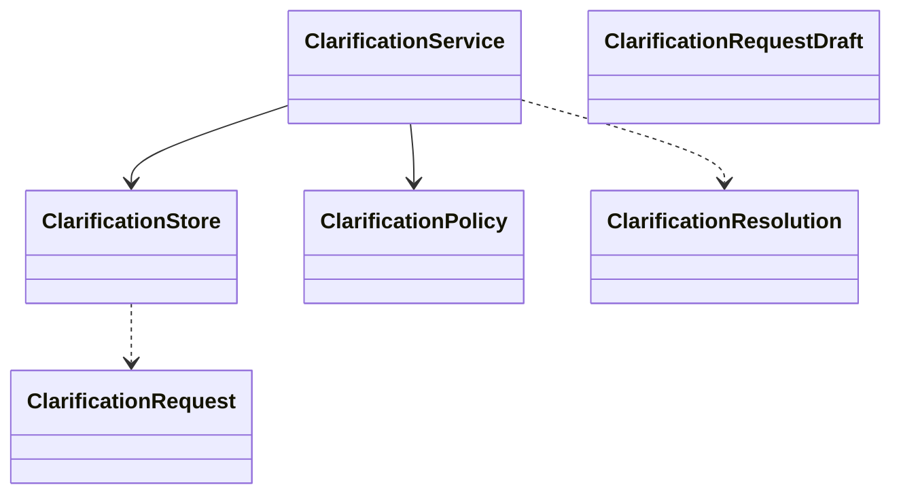

# clarification

## 职责与非职责

`clarification` 把“需要问用户”提升为正式、可恢复、可审计的执行对象。它负责创建、去重、记录回答和标记解析结果，并把请求绑定到原始 Job / Task / TaskRun / LoopNode / ToolInvocation。

每个 `ClarificationRequest` 同时保存两类内容：`question` 是用户能直接看懂的问题；
`contract_json` 是系统用结构化合同，用来约束后续多轮回答如何抽取、合并和判断完整性。

非职责：

- 不识别用户意图；意图仍由 `intent` 负责。
- 不执行长任务；回答后的续跑由 `control` 提交后台 Worker，再由 `recovery` 和 `loop` 完成。
- 不根据 `status != READY` 推断澄清原因；必须有显式 `ClarificationRequest`。

## 类图



## 核心流程

```text
TaskGraph / Loop / Tool detects missing input
  → ClarificationRequestDraft
  → ClarificationPolicy 去重与轮次校验
  → ClarificationRequest OPEN(question + contract_json)
  → Agent Path 展示问题
  → 用户消息被 ControlTurnInitializer 绑定为 answer
  → PendingInteractionCompletionPolicy 判断结构化事实是否满足合同
      → 未满足：保持 OPEN，resolution_json 保存部分事实快照
      → 已满足：ANSWERED → RESOLVED
  → TaskGraph: Task 恢复 READY
  → Loop/ToolCall: origin LoopNode + TaskRun 写入 CLARIFICATION_ANSWERED checkpoint
  → ControlJobWorker 提交 TaskRunResumeExecutor 续跑
```

## 类与功能关系

- `ClarificationService.openForTaskGraph`：用于 Control/Job 规划阶段的 TaskGraph 澄清。
- `ClarificationService.open`：用于 LoopNode / ToolCall 等任意恢复点。
- `ClarificationService.recordPartialAnswer`：记录多轮补充中的结构化事实，但不恢复执行。
- `ClarificationResolution`：记录用户回答被绑定回哪个恢复目标。
- `ClarificationRequest.contractJson`：固定本次澄清合同，避免后续追问内容随模型自由漂移。

## 扩展点与测试入口

- 后续可增加授权审批型 `authorization_request` 与 Clarification 并行的等待机制。
- 需要覆盖：重复问题拒绝、回答幂等、TaskGraph 恢复、LoopNode 恢复、Agent Path 投影。
