# context

## 职责

`context` 负责把 Conversation、Intent 和 Loop 所需的信息结构化为可审计的上下文视图。它不是简单字符串拼接，而是先构造统一 `ContextEnvelope`，再按调用目的装配 Prompt View。

## 非职责

- 不执行模型调用。
- 不选择工具。
- 不持久化 Conversation 消息；只读取可见消息作为上下文事实源。
- 不泄露模型隐藏思维。
- 不在本轮做最近 N 轮截断；后续压缩机制应接入 `ContextAssembler`。

## 类图

```mermaid
classDiagram
  class LoopContextBuilder
  class ContextAssembler
  class ContextEnvelope
  class ContextConversation
  class ContextMessage
  class ClarificationRequest
  class LoopContextSnapshot
  class ContextBlock
  class ContextBlockType
  class ToolCatalogService

  ContextAssembler --> ContextEnvelope
  ContextEnvelope --> ContextConversation
  ContextEnvelope --> ContextMessage
  ContextEnvelope --> ClarificationRequest
  LoopContextBuilder --> LoopContextSnapshot
  LoopContextBuilder --> ContextAssembler
  LoopContextSnapshot --> ContextBlock
  ContextBlock --> ContextBlockType
  LoopContextBuilder --> ToolCatalogService
```



## 核心流程

```text
ConversationId
  → ContextAssembler
  → ContextEnvelope
      + visible messages
      + open clarifications
      + resolved clarification facts
  → IntentPromptView / LoopConversationBlocks

RunExecutionContext
  + CapabilityPlanningContext
  + ToolCatalog
  + ContextEnvelope projection
  → LoopContextBuilder
  → LoopContextSnapshot
  → PromptRegistry 渲染模型上下文
```

## 扩展点

- Conversation memory 压缩。
- RAG/file-search/web-search Observation 注入。
- Token 预算裁剪。
- 上下文块重要性评分和淘汰策略。
- ContextAssembleTrace：记录 included/omitted block、token 估算与 source id。
- 已解决澄清事实会作为 Conversation 级系统上下文注入模型，但不会作为用户聊天消息展示。
