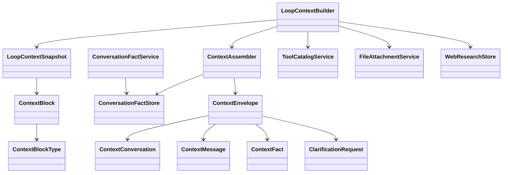

# context

## 职责

`context` 负责把 Conversation、Intent 和 Loop 所需的信息结构化为可审计的上下文视图。它不是简单字符串拼接，而是先构造统一 `ContextEnvelope`，再按调用目的装配 Prompt View。

## 非职责

- 不执行模型调用。
- 不选择工具。
- 不持久化 Conversation 消息；只读取可见消息作为上下文事实源。
- 不泄露模型隐藏思维。
- 不在本轮做最近 N 轮截断；后续压缩机制应接入 `ContextAssembler`。

## 类图



## 核心流程

```text
ConversationId
  → ContextAssembler
  → ContextEnvelope
      + visible messages
      + open clarifications
      + resolved clarification facts
      + persisted conversation facts
  → IntentPromptView / LoopConversationBlocks

RunExecutionContext
  + CapabilityPlanningContext
  + ToolCatalog
  + Conversation Files
  + Web Research Evidence Pool
  + ContextEnvelope projection
  → LoopContextBuilder
  → LoopContextSnapshot
  → PromptRegistry 渲染模型上下文
```

## 扩展点

- Conversation memory 压缩。
- ConversationFact 抽取、合并、过期和置信度策略。
- RAG/file-search/web-search Observation 注入；Web Research 证据池以
  `Web Research Evidence Pool` 形式进入 Loop Context，并区分
  `SEARCH/CANDIDATE` 与 `SOURCE/EVIDENCE`。
- Conversation 文件清单注入；文件正文必须由模型通过 `file.read` 显式读取。
- Token 预算裁剪。
- 上下文块重要性评分和淘汰策略。
- ContextAssembleTrace：记录 included/omitted block、token 估算与 source id。
- 已解决澄清事实会作为 Conversation 级系统上下文注入模型，但不会作为用户聊天消息展示。
- `conversation_fact` 保存用户在澄清或普通对话中已经明确给出的结构化事实；
  这些事实会注入 Intent 与 Loop Context，但不会被伪造成聊天消息。

## r18 任务作用域上下文

- `TaskScopedContextProjector` 在 Loop Context 构建阶段保留可见聊天历史，但只注入当前
  `Job + TaskIntentScope` 允许的结构化事实与澄清事实。
- 稳定身份事实（如姓名、昵称）可以在 Conversation 内复用；用途、风格、长度、地点等任务参数
  默认写入 `JOB:<jobId>`，避免混合意图兄弟 Job 互相污染。
- 历史 Job 没有 `TaskIntentScope` 时仍使用旧的 `ContextAssembler.loopConversationBlocks`，
  保持兼容。
