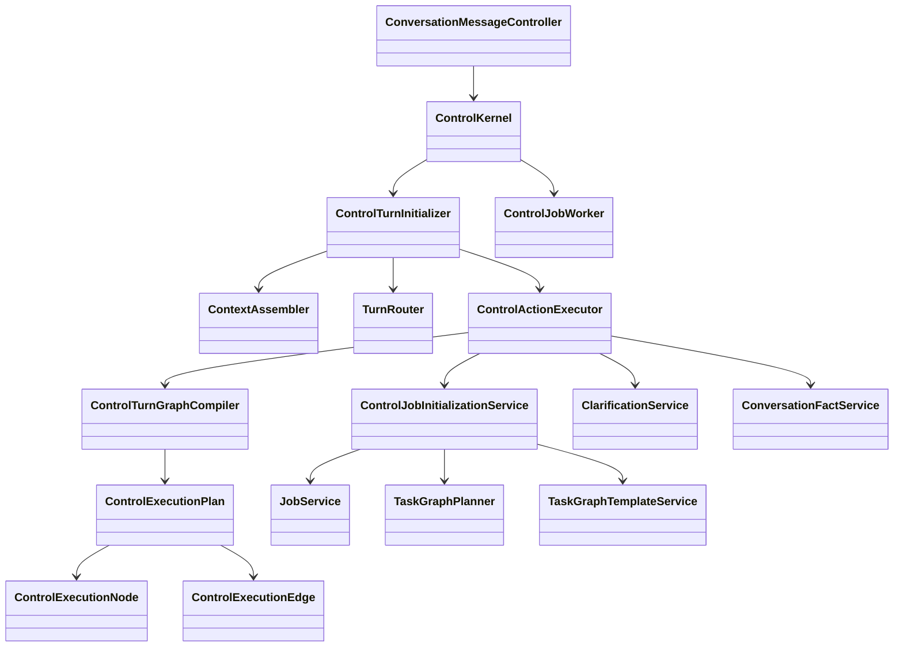

# Control 模块

## 职责与非职责

- 负责 ControlTurn、ControlDecision、聊天轮次路由、控制命令、用户状态反馈和后台派发。
- 消费 Intent 输出的 `TurnIntentGraph`，编译成 `ControlExecutionPlan` 后执行。
- 可以创建 Job、恢复 Clarification、写入 conversation fact、提交后台 dispatch。
- 不拥有 Conversation/Message，不执行 TaskGraph 内部调度，不执行 Loop 动作。
- 不解析自然语言；自然语言理解属于 Intent。

## 类图



## 核心流程

```text
User Message
  -> ControlTurnInitializer
  -> ContextEnvelope
  -> TurnRouter
  -> TurnRoutingPlan(TurnIntentGraph)
  -> ControlTurnGraphCompiler
  -> ControlExecutionPlan
  -> ControlActionExecutor
      -> ANSWER_PENDING: 记录 facts / 判断合同 / 恢复等待点
      -> CREATE_JOB: 使用 JobInitializationSpec 创建根 Job
      -> DISAMBIGUATION: 输出用户可见消歧问题
      -> CONTROL_COMMAND: 输出控制反馈
  -> ControlDecision
  -> ControlDispatchCommand
  -> ControlJobWorker
```

## 混合意图编排

Control 不再按线性 action 列表猜“某个澄清未完成后还能不能继续”。现在的规则是：

```text
TurnIntentGraph edge 决定阻塞传播
```

- 某节点进入澄清/等待，只会阻塞依赖它的下游节点。
- 没有依赖关系的兄弟节点可以继续执行。
- 消歧和无目标澄清属于全局保护，会停止本轮后续执行。

示例：

```text
用户：我叫冯建松，顺便查北京天气

node-1 ANSWER_PENDING  -> 个人介绍任务补充姓名
node-2 NEW_JOB         -> 北京天气查询
edge: none

结果：node-1 如果仍缺用途/风格，可以继续等待；node-2 仍然会创建天气 Job。
```

依赖示例：

```text
用户：查北京天气，然后根据天气写出门建议

node-1 NEW_JOB / WEATHER_QUERY
node-2 NEW_JOB / TEXT_GENERATION
edge: node-1 -> node-2 DEPENDS_ON_RESULT

结果：node-1 未完成前，node-2 不执行。
```

## 类与功能关系

- `ControlTurnInitializer`：短事务入口，写入用户消息和 ControlTurn，组装上下文并调用 TurnRouter。
- `ControlTurnGraphCompiler`：把 Intent 的语义图机械编译成 Control 可执行计划。
- `ControlExecutionPlan`：Control 本轮执行节点和依赖边。
- `ControlActionExecutor`：执行节点，统一处理 Job 创建、澄清恢复、facts 写入和 dispatch。
- `JobInitializationSpec`：从一个 `TurnIntentNode` 编译来的 Job 初始化输入，隔离 nodeId、taskType、canonicalGoal、labels/risk/contract。
- `ControlJobInitializationService`：Provider 解析、TaskGraphTemplate 匹配、动态 TaskGraph 规划、TaskGraph 澄清注册。
- `ControlUserResponseRenderer`：用户可见 Control 消息渲染边界。
- `ControlJobWorker`：事务提交后的后台 Job/Task 执行入口。

## 所有权和允许依赖

- Control 可以依赖 Conversation、Intent、Clarification、Job、Runtime。
- Job/Task/Loop 禁止反向依赖 Control。
- Control 只编排 Job 之前和 Job 提交之后的控制边界，不进入 Loop Kernel 内部执行。

## 扩展点与测试入口

- 扩展执行节点：`ControlActionExecutor` 中新增 action 分支。
- 扩展依赖执行语义：`ControlExecutionRelationType` 和 `ControlExecutionPlan.blockedByUpstream`。
- 扩展 Job 初始化策略：`JobInitializationSpec` 与 `ControlJobInitializationService`。
- 测试入口：
  - `ControlActionExecutorTest`
  - `ControlJobInitializationServiceTest`
  - `LayerDependencyTest`
