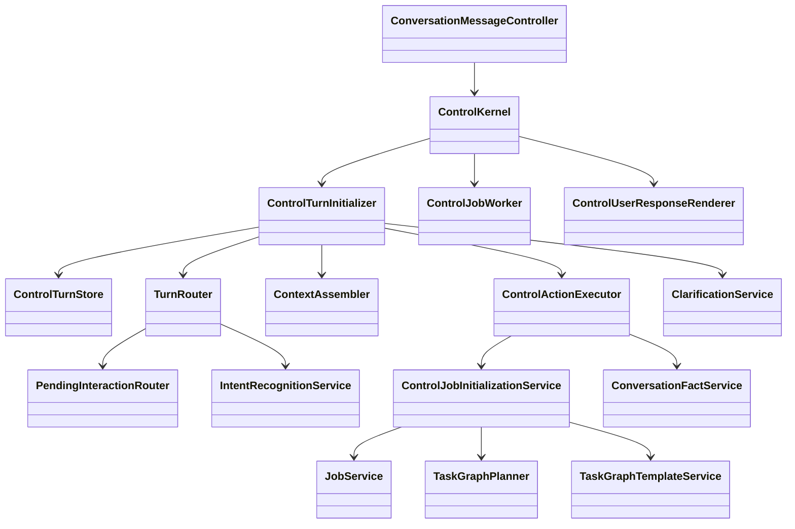

# Control 模块

## 职责与非职责

- 负责 ControlTurn、ControlDecision、聊天轮次路由、控制命令和用户状态反馈。
- Control 是控制平面；不存在名为 `Control` 的聚合对象。
- 不拥有 Conversation/Message，不执行 TaskGraph 内部调度或 Loop 动作。

## 类图

## 核心流程

用户 Message → 创建 ControlTurn → ContextEnvelope → TurnRouter
→ TurnRoutingPlan → ControlActionExecutor
→ 可选 Job 初始化 / Clarification 恢复 / ConversationFact 写入
→ ControlTurn 完成 → 后台 Worker 执行 Job。

`TurnRoutingPlan` 可以包含多条动作。例如用户先回答一个等待澄清，又顺手提出新目标时，
Control 会在同一轮持久化结构化事实、恢复原等待点，并创建新的 Job 派发命令。当前混合意图
只做保守入口，不处理复杂“回答 + 修改 + 取消 + 新任务”组合；这些会继续留给 Router 模型化。

Control 不再把 `JOB_ACCEPTED` 这类内部调度状态写入聊天消息。用户可见消息只包括自然回复、澄清问题、消歧问题和失败提示。

当 Router 识别为澄清回答时，Control 只负责把结构化 facts 与回答绑定回原恢复点；
是否继续执行、如何验收和如何产出最终回复仍由 Job/Task/Loop 后续阶段负责。

## 类与功能关系

- `ControlKernel`：一轮控制处理的应用门面。
- `ControlTurnInitializer`：短事务创建 Message、ControlTurn，并把路由计划交给执行器。
- `ControlActionExecutor`：执行 `TurnRoutingPlan`，统一创建 Job、恢复等待点、写入结构化事实和生成派发命令。
- `ControlDispatchCommand`：Control 事务提交后交给 Worker 的后台执行请求。
- `ControlJobInitializationService`：从意图结果创建根 Job，负责 Provider 解析、TaskGraphTemplate 匹配、动态规划和 TaskGraph 级澄清注册。
- `ControlUserResponseRenderer`：把 Control-only 决策转换为聊天室可见消息，避免把审计摘要或内部命令 ACK 直接暴露给用户。
- `ControlJobWorker`：v0.1 本机后台 Worker，异步执行 Job；完成时写回用户可见结果，WAITING_HUMAN 时写回正式澄清问题，并定时 replay 已创建但未启动的 Job。
- `ControlTurnStore`：ControlTurn/ControlDecision 的唯一写入端口。

## 所有权和允许依赖

允许依赖 Conversation、Intent、Job、Clarification 和 Runtime。下层禁止反向依赖 Control。

## 扩展点与测试入口

可扩展暂停、恢复、取消和多轮澄清命令；测试入口为幂等 ControlTurn、事务回滚和 ArchUnit。
 
