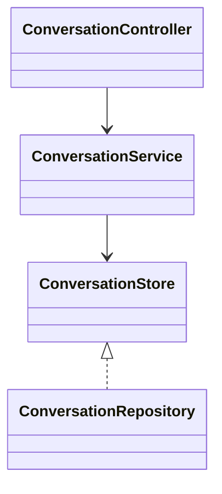

# Conversation 模块

## 职责与非职责

- 负责 Conversation、Message、上下文查询和消息持久化。
- 不持久化 ControlTurn/ControlDecision，不识别意图，不创建 Job。
- 聊天查询只返回用户可见消息；内部调度状态进入 RuntimeEvent / Agent Path，不进入可见消息上下文。

## 类图

## 核心流程

创建/查询 Conversation → 插入或读取可见 Message → 为 ContextAssembler / ControlKernel 提供会话事实。

## 类与功能关系

- `ConversationService`：Conversation 创建和查询。
- `AssistantMessageService`：结果消息写入。
- `UserFacingResponseRenderer`：把执行层原始结果净化为用户可见回复。
- `ConversationStore`：Conversation/Message 唯一持久化端口。

## 所有权和允许依赖

Conversation 不依赖 Control、Job、Task 或 Loop。HTTP Controller 属于 Web Adapter。

## 扩展点与测试入口

可扩展上下文压缩、消息可见性策略和消息类型；测试入口为消息幂等、上下文顺序和模块依赖。
