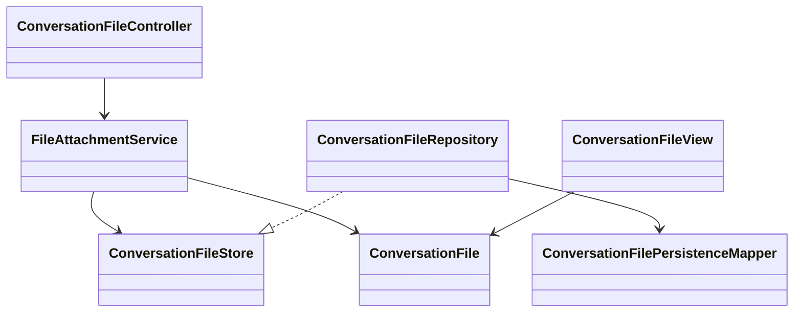

# file

## 职责与非职责

`file` 负责 Conversation 级附件和受控生成文件。上传文件会保存为 `conversation_file`，
Loop 可以通过框架 Tool 读取、搜索或写入新的受控文件。

非职责：

- 不允许模型访问宿主机任意路径。
- 不把文件正文伪造成聊天消息。
- 不执行脚本或外部副作用。

## 类图



## 核心流程

```text
Frontend multipart upload
  → ConversationFileController
  → FileAttachmentService
  → .data/artifacts/conversation-files/{conversationId}/{fileId-name}
  → conversation_file
  → LoopContextBuilder 注入文件清单
  → ReActActionPlanner 选择 file.read / file.search / file.write
```

## 扩展点与测试入口

- 后续可接入 PDF、Word、Excel 解析器和文件内容索引。
- 写文件当前只创建受控 Conversation 文件，不覆盖原文件。
- 测试入口为上传边界、文本读取、搜索、非法路径和大小限制。
