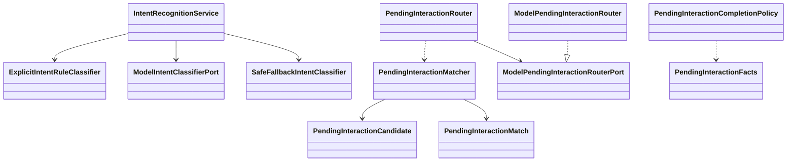

# Intent 模块

## 职责与非职责

- 负责规则、模型、降级与结构化结果校验。
- 只输出任务语义、标签、风险与澄清需求，不操作 Job。
- 不生成最终自然语言回复；简单问答也输出 `CHAT_QA` 并交给 Loop 执行。
- 负责等待交互候选匹配与后续模型化 Router，不默认把用户下一条消息绑定给最近的 Clarification。
- 负责从用户补充中抽取结构化事实草稿，例如姓名、用途、风格、长度、目标对象。
- 负责识别“解释当前还缺什么”的等待交互帮助请求，但不在本模块里实现混合意图。

## 类图



## 核心流程

显式规则 → 模型分类 → 安全降级 → 统一合同校验。

`CHAT_QA` 与 `CREATE_JOB` 都会触发 Job 创建。Intent 只决定语义入口，不决定“直接回答”。

用户消息进入常规 Intent 识别前，会先进入 Conversation 级 Pending Interaction Router：

```text
User Message
  + Conversation Context
  + Open Clarification / Approval / Waiting Interaction
  + Resolved Clarification Facts
      → PendingInteractionRouter
      → model structured route when allowed
      → conservative matcher fallback
      → ANSWER_CLARIFICATION / SELECT_PENDING_INTERACTION / EXPLAIN_PENDING_REQUIREMENTS
      → NEW_INTENT / AMBIGUOUS / CONTROL_COMMAND
```

只有目标仍然存在、选择型路由携带可绑定回答、合同通过校验时才恢复对应等待点；
低置信或目标失效会降级到保守规则，多候选不确定时返回消歧。

Router 只负责抽取事实和选择等待项；`PendingInteractionCompletionPolicy` 负责把
原澄清问题、模型 missingFields 与累计事实对齐，决定本轮回答是否完整。未完整时
Control 只记录部分事实并保持 Clarification 打开，禁止启动 Loop 让模型自由追问。

结构化澄清由两部分组成：用户可见的自然语言问题，以及系统使用的合同 JSON。
合同 JSON 记录必填槽位、可默认槽位、别名和默认授权短语。默认授权只能补齐
`defaultable=true` 的槽位，不能绕过不可默认的关键输入。当前没有 open pending interaction
时，模型误判出的 `CLARIFICATION_ANSWER` 不会被本地规则改写成新任务；混合意图下一轮单独设计。
由于模型生成的合同字段可能使用 `context/tone/identity` 等自由命名，完整性策略会先归一到
`purpose/style/background` 等稳定槽位别名，再判断事实是否满足合同。

如果多个等待项属于同类任务，Router 必须先检查 Conversation 中已抽取的结构化事实；
已满足合同的等待项不应重复追问，而应直接恢复或复用已知事实。

## 类与功能关系

- `IntentRecognitionService`：固定优先级管线。
- `ModelIntentClassifier`：版本化 Prompt 与模型适配。
- `IntentRecognition`：不可变输出合同。
- `IntentType.CHAT_QA`：寒暄或简单问答入口，由 Loop 负责最终响应。
- `PendingInteractionRouter`：正式等待交互入口，负责模型结构化路由、合同校验和降级匹配。
- `ModelPendingInteractionRouter`：使用版本化 Prompt 输出结构化 JSON，只返回系统合同，不直接生成聊天消息。
- `PendingInteractionMatcher`：保守降级策略，不默认绑定最近等待项。
- `PendingInteractionCompletionPolicy`：结构化合同完整性判断，决定回答是否允许恢复执行。
- `PendingInteractionFacts`：系统用结构化事实草稿，不直接展示给用户。
- `PendingInteractionRouteType.EXPLAIN_PENDING_REQUIREMENTS`：解释当前合同还缺哪些信息，不绑定回答、不恢复任务。

## 所有权与依赖

拥有 Intent 语义，不拥有 Conversation 或 Job。允许依赖 Prompt、Provider 与 Runtime。

## 扩展点与测试入口

扩展分类器、标签 Schema、等待交互字段 Schema 和风险策略；
入口为 `IntentRecognitionServiceTest`、`PendingInteractionMatcherTest`、
`PendingInteractionRouterTest`、`PendingInteractionCompletionPolicyTest`。
