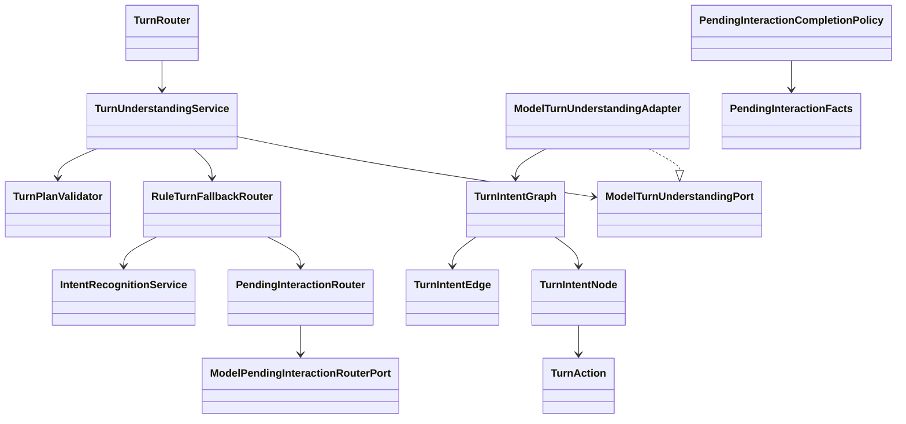

# Intent 模块

## 职责与非职责

- 负责整轮用户输入理解：混合意图、pending 交互匹配、任务级意图改写、风险与标签识别。
- 正式输出 `TurnIntentGraph`，把一句话中的多个任务、补充信息和依赖关系结构化。
- 只输出语义合同，不创建 Job，不修改 Conversation/Message，不执行 Task/Loop/Tool。
- 不生成最终用户答案；普通聊天也会被表达成可执行语义节点，交给 Control/Job/Loop 后续处理。
- 不做 web/search 查询词改写；查询词、来源读取和证据抽取属于 Loop/Tool/WebSearch 阶段。

## 类图



## 核心流程

```text
User Message
  + Conversation Context
  + Open Pending Interactions
  + Conversation Facts
  + Current Time
      -> TurnUnderstandingService
      -> ModelTurnUnderstandingAdapter
      -> TurnIntentGraph
      -> TurnPlanValidator
      -> TurnRoutingPlan
      -> Control
```

模型可用时，`TurnUnderstandingService` 不再先假设 pending 或新任务的顺序，而是让模型一次性输出 `TurnIntentGraph`：

```text
TurnIntentGraph
  node-1: ANSWER_PENDING / CLARIFICATION_ANSWER
  node-2: NEW_JOB / WEATHER_QUERY
  node-3: NEW_JOB / TEXT_GENERATION
  edge: node-3 DEPENDS_ON_RESULT node-2
```

模型不可用或输出无效时，`RuleTurnFallbackRouter` 只提供保守的单节点降级路径：

```text
PendingInteractionRouter -> IntentRecognitionService -> single-node graph
```

降级路径不会再通过规则拆分混合意图；混合意图是模型图能力的正式职责。

## 类与功能关系

- `TurnIntentGraph`：一次用户消息的语义编排图。
- `TurnIntentNode`：一句话里的一个任务片段、pending 回答、控制命令或消歧节点。
- `TurnIntentEdge`：节点依赖关系，例如独立、结果依赖、顺序依赖、消歧依赖。
- `TurnTaskType`：稳定任务类型枚举，避免只靠自由文本 labels 路由。
- `TurnUnderstandingService`：主入口，调用模型、校验图、必要时降级。
- `ModelTurnUnderstandingAdapter`：渲染 Prompt，解析 `nodes/edges` JSON，并兼容旧 `actions` 输出。
- `TurnPlanValidator`：校验节点数量、nodeId 唯一性、边端点、阻塞依赖 DAG、pending target、rewrite 边界。
- `RuleTurnFallbackRouter`：模型不可用时的单节点安全兜底。
- `PendingInteractionRouter`：作为降级能力和局部 pending 匹配能力保留，不再主导混合意图编排。
- `PendingInteractionCompletionPolicy`：评估结构化 facts 是否满足澄清合同。

## 所有权和允许依赖

- Intent 可以依赖 Prompt、Provider、Context 视图和 Runtime 中立合同。
- Intent 不允许依赖 Control、Job、Task、Loop，也不允许持久化或恢复运行状态。
- Intent 输出的 `TurnIntentGraph` 是纯语义合同；Control 才能把它编译成执行计划。

## 扩展点与测试入口

- 扩展任务类型：`TurnTaskType`。
- 扩展节点语义：`TurnIntentNodeKind`。
- 扩展依赖关系：`TurnDependencyType`。
- 扩展模型合同：`prompts/control/turn-understanding/v1/system.md`。
- 测试入口：
  - `TurnRouterTest`
  - `TurnUnderstandingSmokeTest`
  - `PendingInteractionRouterTest`
  - `PendingInteractionCompletionPolicyTest`
