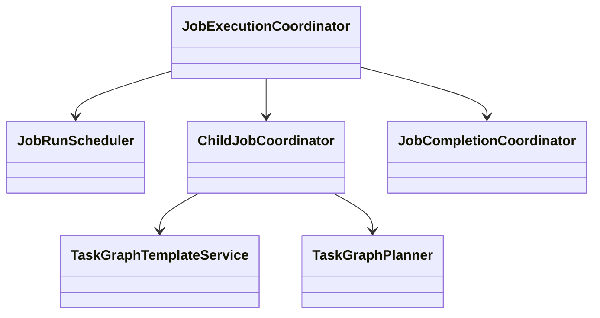

# Job 模块

## 职责与非职责

- 负责 Job、TaskGraph、TaskGraphTemplate、Child Job、Job 调度与 Job 验收。
- 不执行具体模型或 Tool 动作。

## 类图

## 核心流程

创建 Job → 物化 TaskGraph → 调度 READY Task → 接收 Loop Outcome → 推进图或完成 Job。

ChildJobRequest → 校验递归/预算边界 → 创建子 Job 与派生事实 → 父运行等待恢复。

## 类与功能关系

- `JobService`：Job 与 TaskGraph 创建/查询。
- `TaskGraphTemplateService`：模板版本、checksum 与匹配。
- `ChildJobCoordinator`：阻塞型子 Job 物化。
- `JobCompletionPolicy`：全局验收。

## 所有权与依赖

拥有 Job、TaskGraph 和派生关系。允许依赖 Task、Loop 执行端口与 Runtime，不依赖 Control。

## 扩展点与测试入口

扩展模板匹配、调度器和子 Job Worker；入口为 Job/Template API、策略测试与 ArchUnit。

