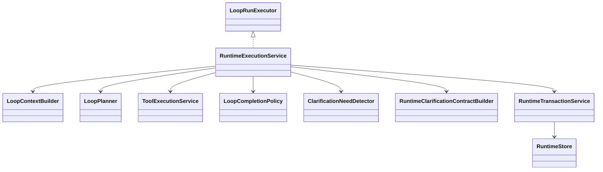

# loop

## 职责与非职责

`loop` 是执行内核，负责 `LoopRun`、`LoopTree`、`LoopNode`、ReAct 阶段、局部规划、动作执行、Observation、Evidence、Checkpoint 和 Loop 级验收。

非职责：

- 不创建或推进 Job / TaskGraph。
- 不拥有 Conversation / ControlTurn。
- 不直接物化 Child Job；Loop 只返回 `ChildJobRequest`，由 Job 层物化。

## 类图



## 核心流程

```text
Context Build
  → Planning
  → Action Preparation
  → Action Execution (model/tool/skill/clarification/child derivation)
  → Observation
  → Evaluation
  → Complete / Adjust / ChildLoop / ChildJob / WAITING_HUMAN
```

`CLARIFICATION_REQUEST` 的恢复流：

```text
LoopPlan(CLARIFICATION_REQUEST)
  → ToolExecutionService 执行 clarification.request
  → ClarificationRequest OPEN
  → LoopNode + TaskRun = WAITING_HUMAN
  → 用户回答
  → CLARIFICATION_ANSWERED checkpoint
  → TaskRunResumeExecutor
  → completeRecoveredClarificationAction
  → Observation / Evaluation
```

如果模型动作返回“请补充/请提供/需要更多信息”等缺失输入问题，`ClarificationNeedDetector`
会把自然语言问题升级为正式 `clarification.request` Tool 动作，禁止被“非空文本”验收完成。
升级时 `RuntimeClarificationContractBuilder` 会补充结构化 `contract_json`，描述哪些字段可以由
“随意 / 默认 / 没有了”提前收口，避免恢复判断退回到自然语言字段推断。

## 类与功能关系

- `RuntimeExecutionService`：ReAct 编排器，分发模型、Tool、Skill、Clarification、ChildLoop、ChildJob。
- `RuntimeTransactionService`：阶段、事件、Checkpoint、等待态和恢复态的短事务边界。
- `LoopPlanner`：把 Capability 派生和局部策略转换为 `LoopPlan`。
- `LoopCompletionPolicy`：Loop 局部验收。
- `ClarificationNeedDetector`：检测模型输出是否其实需要用户补充信息。
- `RuntimeClarificationContractBuilder`：为 Loop 运行时自然语言澄清兜底生成结构化合同。
- `LoopNodeStateMachine`：集中定义 `RUNNING / WAITING_CHILD_JOB / WAITING_HUMAN / COMPLETED` 等状态迁移。

## 所有权与允许依赖

允许依赖：`runtime`、`provider`、`capability`、`context`、`tool`、`prompt`、`recovery` 租约。

禁止依赖：`control`、`job`、`task` 聚合写模型。Loop 不直接修改 Job/Task 终态。

## 扩展点与测试入口

- 扩展 Tool / RAG / Web / File Search action executor。
- 扩展模型结构化 planner，让模型可显式选择 Tool。
- 测试入口：Loop 策略测试、Recovery 测试、ArchUnit 依赖测试、Agent Path 投影测试。
