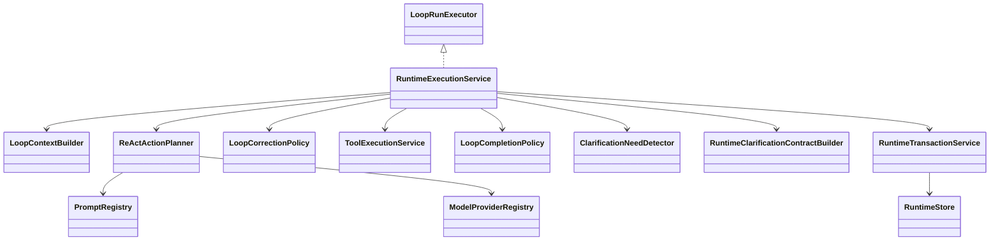

# loop

## 职责与非职责

`loop` 是执行内核，负责 `LoopRun`、`LoopTree`、`LoopNode`、ReAct 阶段、局部规划、动作执行、Observation、Evidence、Checkpoint 和 Loop 级验收。

非职责：

- 不创建或推进 Job / TaskGraph。
- 不拥有 Conversation / ControlTurn。
- 不直接物化 Child Job；Loop 只返回 `ChildJobRequest`，由 Job 层物化。

## 类图



## 核心流程

```text
Context Build
  → Planning (native model action or fallback ReActActionPlanner)
  → Action Preparation
  → Action Execution (model answer / native tool_call / fallback tool / skill / clarification / child derivation)
  → Observation
  → Evaluation
  → Complete / Adjust / ChildLoop / ChildJob / WAITING_HUMAN
```

`CLARIFICATION_REQUEST` 的恢复流：

```text
LoopPlan(CLARIFICATION_REQUEST)
  → ToolExecutionService 执行 clarification.request
  → ClarificationRequest OPEN
  → LoopNode + TaskRun = WAITING_HUMAN
  → 用户回答
  → CLARIFICATION_ANSWERED checkpoint
  → TaskRunResumeExecutor
  → completeRecoveredClarificationAction
  → Observation / Evaluation
```

如果模型动作返回“请补充/请提供/需要更多信息”等缺失输入问题，`ClarificationNeedDetector`
会把自然语言问题升级为正式 `clarification.request` Tool 动作，禁止被“非空文本”验收完成。
升级时 `RuntimeClarificationContractBuilder` 会补充结构化 `contract_json`，描述哪些字段可以由
“随意 / 默认 / 没有了”提前收口，避免恢复判断退回到自然语言字段推断。

Tool/Web/RAG/File/Skill 动作返回的是 ReAct Observation，不是最终用户产物。`LoopEvaluator`
会把这些 Observation 推进到下一轮 Child LoopNode，让模型基于工具结果生成用户可见回答。

当前首选执行路径是 Provider 原生 function/tool calling：

```text
LoopPlan(MODEL_CALL)
  → Provider.generate(prompt + tool schemas)
  → assistant content：直接进入 Observation / Evaluation
  → tool_call：Runtime 校验 Tool ID / 参数 / 幂等后执行 ToolExecutionService
```

`ReActActionPlanner` 只作为 fallback：当 Provider 不支持原生工具调用，或 Skill Manifest
已经派生了 Child Loop / Child Job 时，才使用结构化 JSON planner。非法 JSON 会让当前
Loop 失败并进入可观测错误链路，不能静默退回旧的硬编码 MODEL_CALL。

`LoopCorrectionPolicy` 是长任务纠偏入口。v0.1 的确定性规则是：如果上一轮已经产生工具
Observation，下一轮模型调用不再暴露工具 Schema，强制基于已有 Observation 合成结果，
避免 `web.search → Observation → web.search` 这类漂移/循环。后续可扩展目标重锚、
动作重复签名、预算异常、LLM Judge 漂移评分等策略。

## 类与功能关系

- `RuntimeExecutionService`：ReAct 编排器，分发模型、Tool、Skill、Clarification、ChildLoop、ChildJob。
- `RuntimeTransactionService`：阶段、事件、Checkpoint、等待态和恢复态的短事务边界。
- `ReActActionPlanner`：fallback 结构化动作选择器，先处理已加载 Skill Manifest 的 Child 派生，再在 Provider 不支持 native tool calling 时调用模型 JSON planner。
- `LoopCorrectionPolicy`：执行纠偏策略，阻断重复工具调用、长任务漂移等失控趋势。
- `LoopCompletionPolicy`：Loop 局部验收。
- `ClarificationNeedDetector`：检测模型输出是否其实需要用户补充信息。
- `RuntimeClarificationContractBuilder`：为 Loop 运行时自然语言澄清兜底生成结构化合同。
- `LoopNodeStateMachine`：集中定义 `RUNNING / WAITING_CHILD_JOB / WAITING_HUMAN / COMPLETED` 等状态迁移。

## 所有权与允许依赖

允许依赖：`runtime`、`provider`、`capability`、`context`、`tool`、`prompt`、`recovery` 租约。

禁止依赖：`control`、`job`、`task` 聚合写模型。Loop 不直接修改 Job/Task 终态。

## 扩展点与测试入口

- 扩展 Tool / RAG / Web / File Search action executor。
- 扩展 Provider native tool calling、thinking mode、reasoning summary。
- 扩展 `LoopCorrectionPolicy` 的漂移检测和纠偏动作。
- 测试入口：Loop 策略测试、Recovery 测试、ArchUnit 依赖测试、Agent Path 投影测试。
