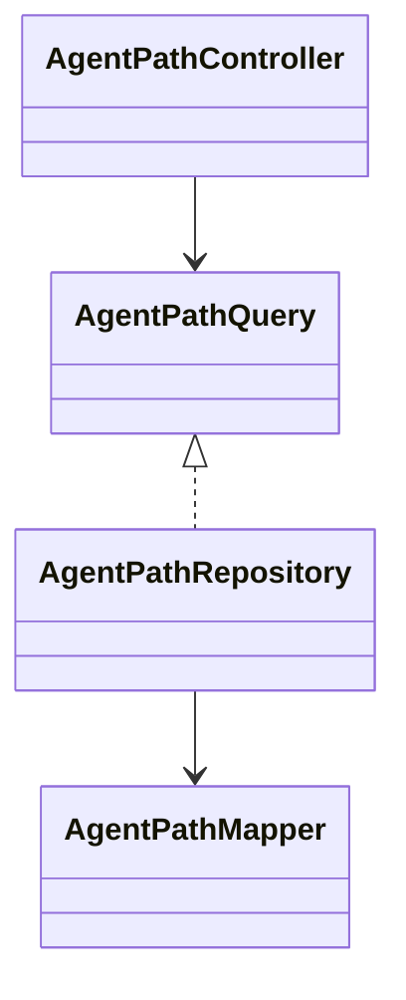

# Observability 模块

## 职责与非职责

- 负责 Agent Path、运行事件和评测事实的跨聚合只读投影。
- 不修改 Conversation、ControlTurn、Job、Task 或 Loop 状态。

## 类图

## 核心流程

Conversation ID → 查询 ControlDecision、Job、TaskRun、Loop、Skill、Tool、Evidence 与 Checkpoint 事实
→ 构建可折叠 Agent Path。

后端投影会把 `LoopNode`、`TaskRun` 等内部运行对象渲染为阶段语义，例如“继续生成最终结果”“等待用户补充”“模型生成”。
前端默认使用简洁模式隐藏 Phase、Checkpoint、ModelCall、RecoveryAttempt 等调试节点；调试模式和复制导出仍保留完整路径。

## 所有权和依赖

Observability 只拥有读模型合同，可以读取各事实表，不得被核心执行模块用于写状态。

## 扩展点与测试入口

可以增加评测时间线、指标聚合和导出视图；测试入口为路径排序、父子关系和只读依赖门禁。
