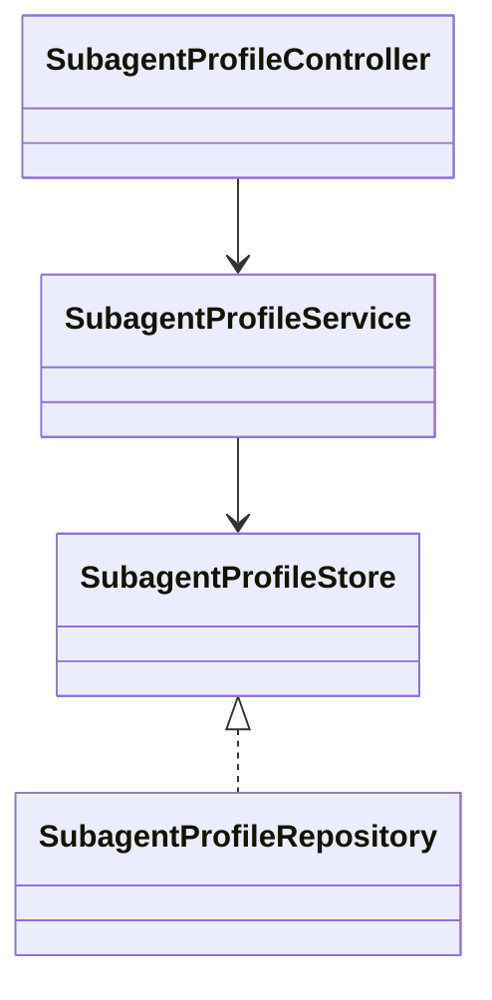

# Profile 模块

## 职责与非职责

- 负责 AgentProfile 与版本化 SubagentProfile 配置。
- 不创建 Job，不执行 Loop，也不直接扩大运行权限。

## 类图

## 核心流程

创建不可变 SubagentProfile → ChildJobRequest 引用版本 → Job 层校验同一 AgentProfile
→ 与父 AuthorityEnvelope 求交集 → 子 Job 使用有效配置。

## 扩展点与测试入口

后续可增加 Profile 激活、废弃和评测基线；测试必须覆盖版本不可变、同 Agent 约束和权限只收窄。
