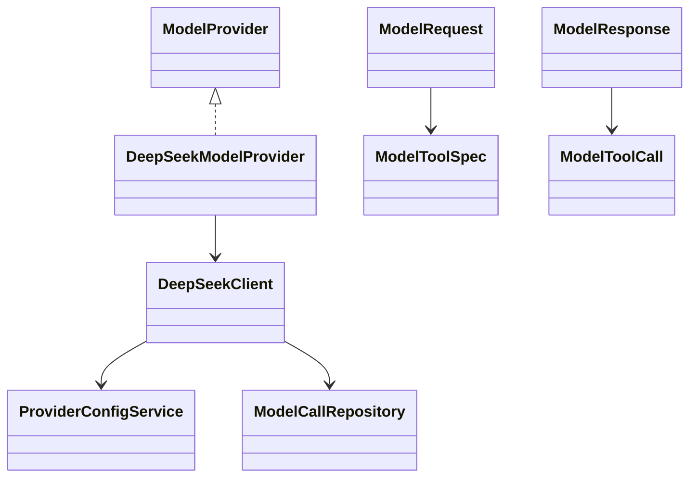

# provider

## 职责与非职责

`provider` 负责把框架无关的 `ModelRequest / ModelResponse` 适配到具体模型厂商 API。
Loop、Intent、Job 只依赖 `ModelProvider` 端口，不直接感知 DeepSeek、GLM 或未来 Spring AI 类型。

非职责：

- 不持久化明文 API Key。
- 不把完整 Prompt、reasoning_content 或敏感上下文默认写入审计表。
- 不执行 Tool；Provider 只返回 `ModelToolCall`，Tool 执行由 `tool` 模块完成。

## 类图



## 核心流程

```text
RuntimeExecutionService
  → ModelRequest(prompt, tools, thinkingMode)
  → ModelProvider.generate
  → ModelResponse(content | toolCalls, reasoningContent)
  → Loop Observation 或 ToolExecutionService
```

支持原生工具调用的 Provider 会收到 `ModelToolSpec`。内部 Tool ID 保留为 `web.search`，
Provider 函数名会转换成 `web_search` 这类安全名称，响应解析后再映射回内部 Tool ID。

## Thinking / Reasoning 设计

`ModelThinkingMode` 是框架级开关：`DISABLED / AUTO / ENABLED`。v0.1 默认 `DISABLED`，
因为思考模型会增加延迟和成本，且不同 Provider 的工具兼容性不同。

- DeepSeek 普通模型：可暴露 function/tool calling；当前默认关闭 thinking 参数。
- DeepSeek reasoner：可能返回 `reasoning_content`，但不暴露工具调用。
- GLM 系模型：后续接入时可把 `ModelThinkingMode` 映射到官方 thinking 配置。

`reasoningContent` 默认只作为模型响应字段和“是否存在”的审计摘要使用，不进入用户可见消息。
如果后续要做“思考路径可视化”，应先做摘要、脱敏、权限和存储周期设计。

## 扩展点与测试入口

- 新增 Provider：实现 `ModelProvider`，声明 `supportsNativeToolCalling()` 和 `supportsThinkingMode()`。
- 新增 thinking 策略：从 Profile / Job / Task / Loop 有效策略中解析 `ModelThinkingMode`。
- 测试入口：Provider 解析测试、Loop native tool calling 测试、模型调用审计测试。
