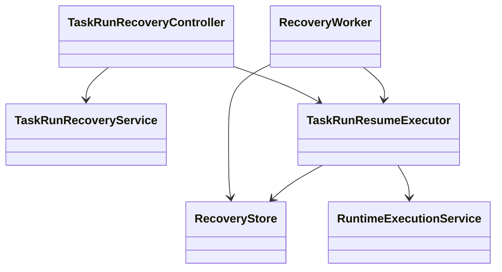

# Recovery 模块

## 职责与非职责

- 负责 TaskRun 租约、Checkpoint 恢复策略、恢复尝试和 ChildJobOutcome 重放。
- 不重新规划 Job，也不绕过各层 CompletionPolicy。

## 类图



## 核心流程

租约过期 → 校验 Checkpoint/checksum/副作用 → 获取租约
→ 从游标续跑 → 分层验收 → 写入恢复审计。

后台流程：

```text
RecoveryWorker 定时扫描可恢复 TaskRun
  → TaskRunResumeExecutor 重新做策略判定
  → 抢占租约
  → 恢复原 LoopNode 或 ChildJobOutcome
```

## 扩展点与测试入口

支持 RUN_START、ACTION_PREPARED、CHILD_LOOP_CREATED 和 CHILD_JOB_CREATED；
测试覆盖活跃租约、损坏游标、未知副作用和 Child Job 事件重放。

v0.1 Worker 是本机扫描器；后续可替换为 Outbox/队列驱动的持久化 Worker。
