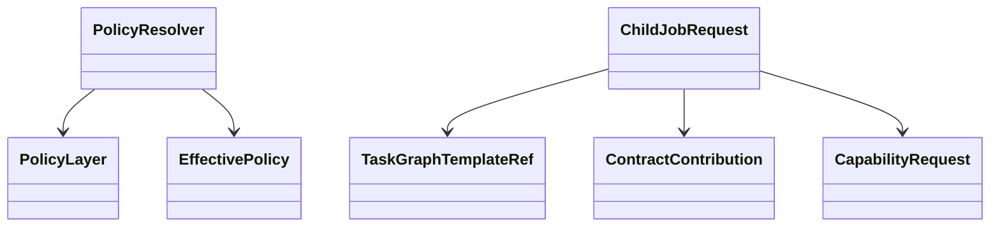

# Runtime 模块

## 职责与非职责

- 提供跨层中立合同、AuthorityEnvelope、预算、策略继承与派生请求。
- 不拥有 Job/Task/Loop 协调器或数据库业务流程。

## 类图

## 核心流程

父级策略 + 子级请求 → 权限交集、预算封顶、合同加强 → ALLOWED / WAITING_APPROVAL / WAITING_HUMAN / REJECTED。

## 类与功能关系

- `PolicyResolver`：统一有效策略计算。
- `AuthorityEnvelope`：只能收窄的权限。
- `ChildJobRequest/Outcome`：Loop 与 Job 的中立交接。
- `RuntimeStateException`：跨层稳定错误合同。

## 所有权与依赖

Runtime 不依赖任何业务上层模块。

## 扩展点与测试入口

扩展成本预算、数据边界和授权策略；入口为 `PolicyResolverTest` 与 ArchUnit。

## r18 TaskIntentScope

- `TaskIntentScope` 是混合意图拆分后的任务级运行边界，属于 Runtime 中立合同。
- Job 创建时将 `TurnIntentNode` 的任务类型、原始片段、规范目标、澄清合同和工具 allowlist
  固化为 `job.effective_policy_snapshot.intentScope`。
- Loop/Context/Tool 只能读取该快照，不能反向依赖 Intent 或 Control。
