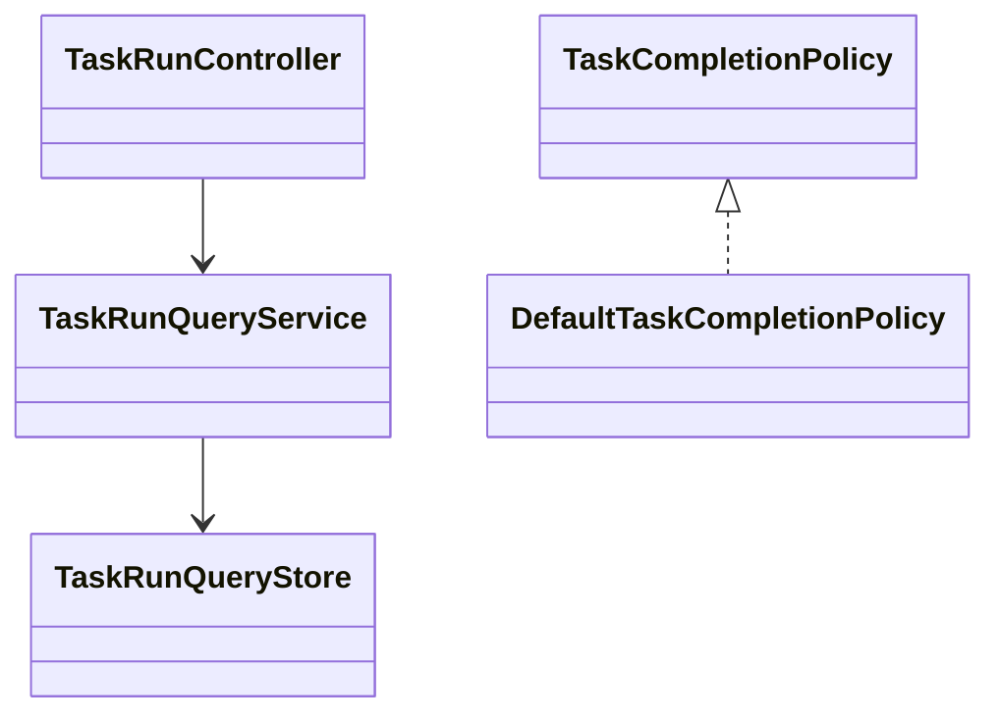

# Task 模块

## 职责与非职责

- 负责 Task、TaskRun、Task Contract、执行策略与 Task 验收。
- 不负责 Job 模板匹配或修改 Job 全局状态。

## 类图

## 核心流程

接收 Job 层调度 → 创建/查询 TaskRun → 交给 Loop → 根据 Evidence 验收 Task。

## 类与功能关系

- `TaskRunQueryService`：TaskRun 只读用例。
- `TaskCompletionPolicy`：Task Contract 验收扩展点。
- `TaskStatus/TaskRunStatus`：Task 层状态所有权。

## 所有权与依赖

允许依赖 Loop 与 Runtime，不依赖 Job 或 Control。

## 扩展点与测试入口

扩展 Task 重试、执行策略和持久化 Worker；入口为 TaskRun API、策略测试与 ArchUnit。

