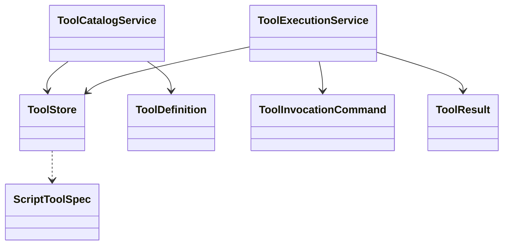

# tool

## 职责与非职责

`tool` 负责把框架 Tool、Skill 脚本资源和 ToolInvocation 审计统一起来。Skill 在运行时也是 Tool：模型或 Planner 选择 `skill.search`、`skill.load`、脚本 Tool 或 `clarification.request`，Loop Kernel 再把结果写回 Observation。

非职责：

- 不拥有 LoopNode / TaskRun 状态迁移；挂起和恢复由 `loop` / `recovery` 负责。
- 不绕过权限、预算、参数校验和副作用分级。
- 不编译 Skill Manifest；Skill 导入和编译仍由 `capability` 负责。

## 类图



## 核心流程

```text
LoopContextBuilder 注入 ToolCatalog
  → LoopPlan 选择 TOOL_CALL / SKILL_LOAD / CLARIFICATION_REQUEST
  → ToolExecutionService 创建 ToolInvocation
  → framework tool 或脚本 tool 执行
  → result_json / error_message 持久化
  → Agent Path 展示 TOOL_CALL
```

`clarification.request` 是特殊 Tool：它创建 `ClarificationRequest` 并把 `ToolInvocation` 关联到该请求；真正的 `WAITING_HUMAN` 状态迁移由 Loop Kernel 在同一条执行链路里完成。该 Tool 支持 `contractJson` 字符串或 `contract` 对象参数，必须把结构化澄清合同持久化到 `clarification_request.contract_json`。

## 类与功能关系

- `ToolCatalogService`：合并 framework tool 和 SkillPackage 中的脚本 Tool。
- `ToolExecutionService`：执行 framework tool、受控脚本 Tool，并维护 ToolInvocation 审计。
- `ToolStore`：隔离 MyBatis 持久化细节。
- `ScriptToolSpec`：脚本解释器、参数 schema、副作用等级和脚本文本的不可变快照。

## 扩展点与测试入口

- 新增外部工具时，优先扩展 `ToolExecutionService` 的 dispatcher，再补 ToolCatalog。
- 脚本执行器当前允许 `python`、`python3`、`node` 和 `internal.echo`，并仅允许 `NONE` / `READ_ONLY` 副作用。
- 需要覆盖：幂等调用、参数缺失、非法解释器、非法副作用、ToolInvocation 入库、Agent Path 投影。
