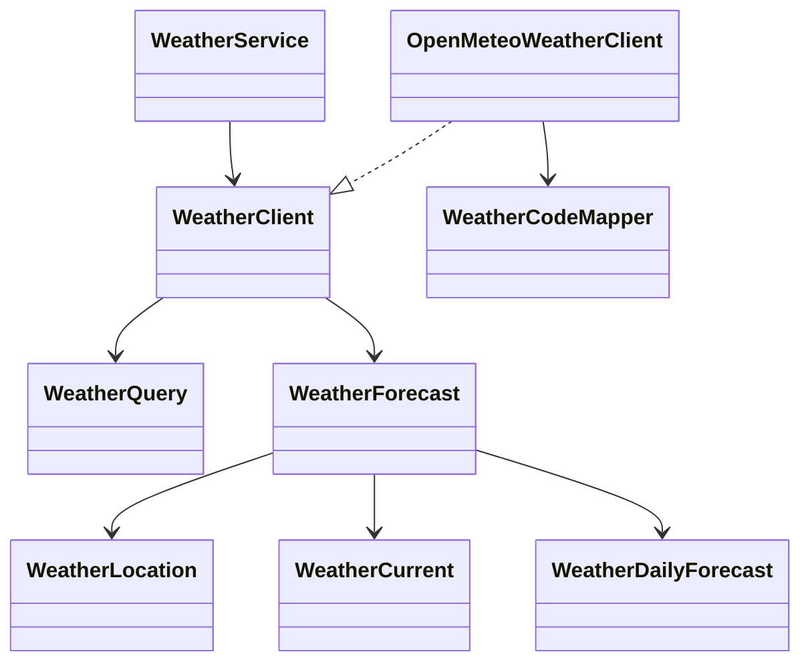

# Weather Module

## 职责

- 把“天气/预报/当前气温”等强时效问题抽象为稳定的框架级工具能力。
- 对上层暴露 `WeatherService` 与结构化 `WeatherQuery`，避免模型自己拼接搜索词。
- 通过 adapter 模式接入具体天气供应商；当前默认实现是 Open-Meteo。

## 非职责

- 不负责通用网页搜索、Deep Research 或证据池持久化。
- 不直接生成用户最终回复；Loop 会把 weather observation 交回模型合成。
- 不保存长期天气历史。

## 类图

## 核心流程

1. Loop 模型通过 function calling 选择 `weather.current`。
2. `ToolExecutionService` 将参数转成 `WeatherQuery`。
3. `WeatherService` 调用 `WeatherClient`。
4. Open-Meteo adapter 先解析地点，再查询当前天气和短期预报。
5. Tool 返回结构化 observation，Loop 下一轮生成用户可见答案。

## 允许依赖

- `weather.application` 可依赖 `weather.domain`。
- `weather.infrastructure` 可依赖 `weather.application.port.out` 与 `weather.domain`。
- 上层通过 `WeatherService` 使用天气能力，不直接依赖 Open-Meteo adapter。

## 扩展点与测试入口

- 新天气供应商：新增 `WeatherClient` adapter。
- 天气语义映射：扩展 `WeatherCodeMapper`。
- 测试入口：`OpenMeteoWeatherClientTest` 与 `ToolExecutionServiceWeatherTest`。
