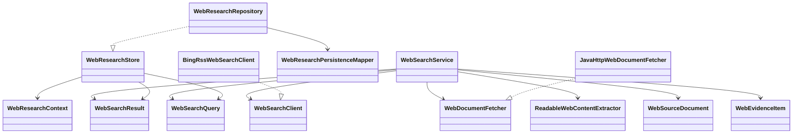

# websearch

## 职责与非职责

`websearch` 负责外部网络搜索适配、公开网页读取、正文清洗、证据片段抽取、URL 安全策略、
超时和结果裁剪。它为 Tool Runtime 提供 `web.search`、`web.fetch` 和 `web.extract`
的应用服务，不直接参与 Loop 状态迁移。

非职责：

- 不生成最终答案。
- 不拥有 Loop 状态迁移。
- 不信任网页内容改变系统指令、工具权限或运行策略。
- 不拥有 ToolInvocation 审计。

## 类图



## 核心流程

```text
ReActActionPlanner
  → LoopPlan(WEB_SEARCH, toolId=web.search)
  → ToolExecutionService
  → WebSearchService
  → WebSearchClient
  → WebSearchRun / WebSearchCandidate
  → SearchResult Observation
```

Search QA 进一步读取来源时：

```text
LoopNode
  → web.search
  → web.fetch / web.extract
  → SourceDocument / EvidenceItem
  → WebResearchStore
  → Observation
  → LoopEvaluator 调整到下一轮 fetch/extract 或 MODEL_CALL
```

## 类与功能关系

- `WebSearchService`：校验查询、裁剪 limit、读取网页、抽取证据。
- `WebSearchClient`：外部搜索 Provider Port。
- `WebDocumentFetcher`：公开网页读取 Port。
- `BingRssWebSearchClient`：无 Key 的本地开发 fallback。
- `JavaHttpWebDocumentFetcher`：默认公开 HTTP(S) 读取实现，受 `WebAccessPolicy` 保护。
- `ReadableWebContentExtractor`：轻量正文清洗、来源类型推断和证据抽取。
- `WebSearchResult`：候选来源，只能作为后续读取线索。
- `WebSourceDocument`：可引用来源文档。
- `WebEvidenceItem`：证据片段。
- `WebEvidenceExtraction`：一次读取产生的来源文档与证据片段集合。
- `WebResearchStore`：搜索运行、候选、来源和证据池持久化 Port。
- `WebResearchRepository`：证据池 MyBatis Adapter。
- `WebResearchContext`：把来源/证据关联回 ToolInvocation、Job、TaskRun 和 LoopNode。

## 证据池与 Agent Path

`web.search` 写入 `web_search_run` 与 `web_search_candidate`，只表示候选检索，
不把未读取的结果写为证据。`web.fetch` 会写入 `web_source_document`；
`web.extract` 会写入 `web_source_document` 和 `web_evidence_item`。

Agent Path 中的结构是：

```text
LoopNode
  → ToolCall(web.search)
      → WEB_SEARCH_RUN
          → WEB_SEARCH_CANDIDATE
  → ToolCall(web.fetch / web.extract)
      → WEB_SOURCE
          → WEB_EVIDENCE
```

这样用户能在右侧路径看到“搜索了什么、读了哪些来源、抽取了哪些证据”，同时不会把
普通 Loop 完成验收用的 `evidence` 表和 Web Research 证据池混在一起。

## 安全边界

- 只允许 `http` / `https`。
- 拒绝带 userinfo 的 URL。
- DNS 解析后拒绝 loopback、内网、链路本地、多播和 IPv6 unique-local 地址。
- 工具结果只写入结构化 Observation，不允许网页正文影响系统 Prompt 或工具权限。

## 扩展点与测试入口

- 当前默认搜索实现为 Bing RSS 适配器，无额外 API Key。
- 后续可增加 Brave、Tavily、Exa、SerpAPI、SearXNG 或自建检索服务。
- Deep Research 已在 Job/TaskGraph 层通过默认研究图编排计划、来源发现、读取证据、证据矩阵、报告合成和复核；配置型 `TaskGraphTemplate` 仍可覆盖默认图。
- 测试入口：RSS 解析、URL 安全拒绝、正文清洗、证据抽取、证据池写入、
  ToolObservation 不直接完成。
