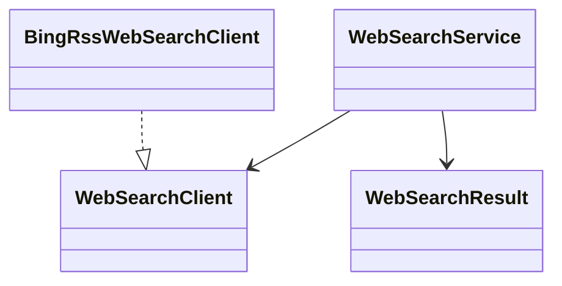

# websearch

## 职责与非职责

`websearch` 负责外部网络搜索适配、结果解析、超时和结果裁剪。它为 Tool Runtime
提供 `web.search` 的应用服务，不直接参与 Loop 状态迁移。

非职责：

- 不生成最终答案。
- 不抓取完整网页正文。
- 不信任网页内容改变系统指令。
- 不拥有 ToolInvocation 审计。

## 类图



## 核心流程

```text
ReActActionPlanner
  → LoopPlan(WEB_SEARCH, toolId=web.search)
  → ToolExecutionService
  → WebSearchService
  → WebSearchClient
  → SearchResult Observation
  → LoopEvaluator 调整到下一轮 MODEL_CALL
```

## 扩展点与测试入口

- 当前默认实现为 Bing RSS HTML/RSS 适配器，无额外 API Key。
- 后续可替换为 Brave、Tavily、SerpAPI、SearXNG 或自建检索服务。
- 测试入口：解析 RSS、限制 topK、空查询拒绝、ToolObservation 不直接完成。
