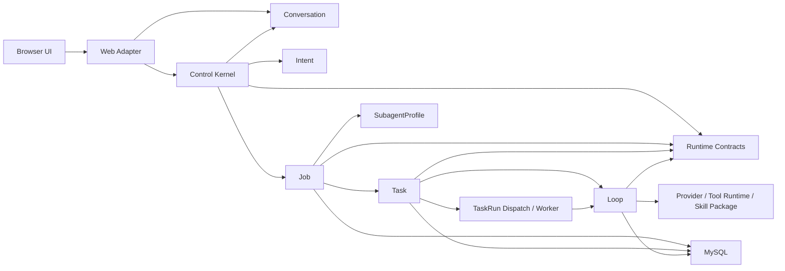

# 02 System Boundary and Context

## 系统内

- 聊天入口、会话持久化、意图识别、Job/TaskGraph 调度。
- TaskRun Worker、Loop 执行、Checkpoint、租约、恢复与事件重放。
- Tool/Skill/Provider 注册与审计。
- TaskGraphTemplate、策略解析、授权请求、分层验收。
- Agent Path、进度投影与评测事实。
- Web Adapter 只处理 HTTP、校验和响应组装，不拥有领域状态。
- Observability 模块负责 Agent Path 读模型，不把跨聚合投影塞入 Conversation。

## 系统外

- DeepSeek API。
- Tool 所连接的外部系统。
- 用户或管理员的授权与人工输入。

## 信任边界

- Secret 只在 Provider Adapter 边界读取。
- 外部模型输出必须经过结构化 Schema 与领域校验。
- Tool 副作用按 NONE、IDEMPOTENT、REVERSIBLE、IRREVERSIBLE 分类。
- 未知或不可逆副作用不能自动重放。
